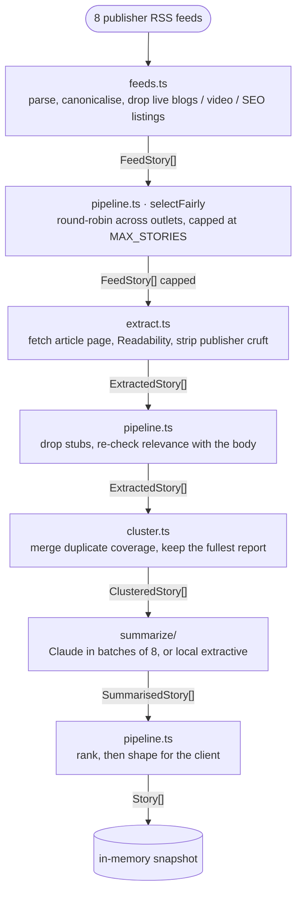
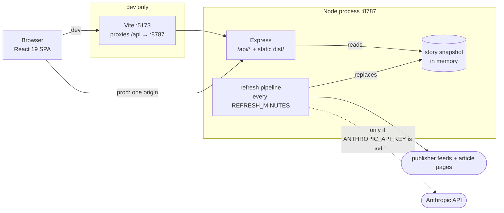
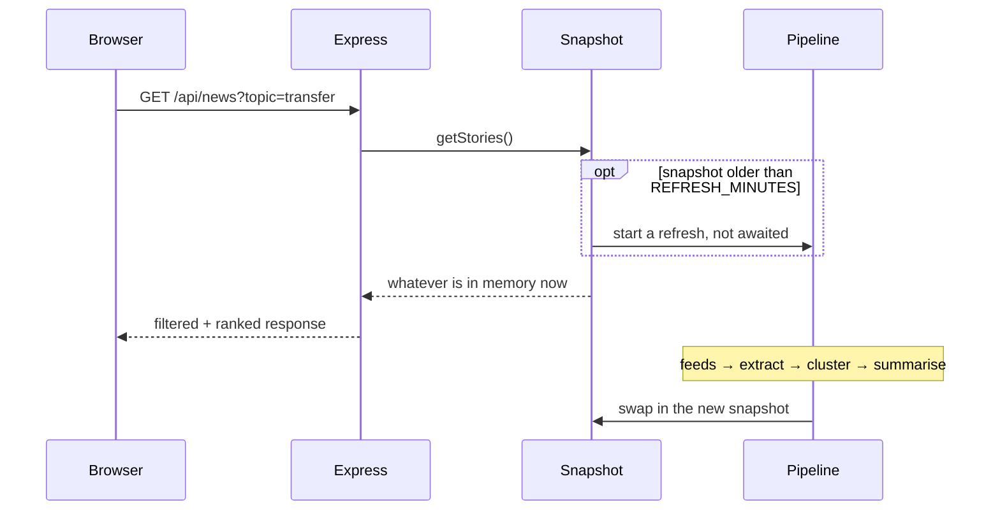

# Touchline

Football news, minus the padding.

Most football sites are paid by the click, so the headline's job is to withhold
the news rather than report it — `'He's the one we wanted': Newcastle sign
Gonzalez` — and you read 600 words to find the one fact you wanted. Touchline
reads those articles for you and gives you the fact:

> **Newcastle sign Nico Gonzalez from Man City**
> Newcastle have signed the 24-year-old midfielder in a deal set to reach £50m
> after add-ons. He will wear the No 6 shirt at St James' Park.
> `£50m` `24-year-old` · 3 sources · saved you ~2m 51s

---

## Running it

```bash
npm install
npm run dev
```

That's the whole setup — no API key, no database, no config. The API comes up on
`:8787`, the app on `:5173`.

For a production build:

```bash
npm run build && npm start   # single origin on :8787
```

`npm run build` typechecks both projects before bundling the frontend, so a
type error fails the build rather than reaching the browser.

## Better summaries (optional)

Out of the box, summaries are built by a local extractive summariser: no API
calls, no cost. It's decent — news is written inverted-pyramid, so scoring
sentences by position, headline overlap and numeric density gets you most of
the way.

Add an Anthropic API key and every summary is written by Claude instead —
headlines genuinely rewritten rather than trimmed, prose that reads like a
person wrote it, and much better judgement about what the actual news is:

```bash
cp .env.example .env
echo "ANTHROPIC_API_KEY=sk-ant-..." >> .env
```

Nothing else changes — the engine is picked at runtime and the UI reports which
one produced the summaries. Cost is kept low by batching (one request covers 8
stories) and by sending only the first ~2,500 characters of each article, which
in news prose is where all the facts live. The system prompt is marked cacheable
so repeated refreshes re-read it at a fraction of the input price.

## How it works



The edge labels are the real types, from `server/types.ts` and `shared/types.ts`.
Each stage widens the story object and the next stage's signature demands the
wider one, so a function that runs after extraction cannot be handed a story
that has not been through it.

1. **Feeds** — publisher RSS from BBC, Guardian, Sky, ESPN, Telegraph,
   Independent, football.london and the Mirror. Live blogs, video pages,
   galleries, paper round-ups and "what channel is it on" SEO listings are
   dropped: none of them compress into "here is what happened".
2. **Relevance gate** — even football-labelled feeds leak darts and golf, so
   every story is checked against football vocabulary before it costs a fetch.
3. **Extraction** — the RSS description is one teaser sentence, so each article
   page is fetched once and run through Mozilla's Readability to get the prose
   without nav, ads or newsletter prompts. Publisher-specific cruft (wire
   credits, datelines, video-player notices) is stripped after.
4. **Clustering** — ten outlets report the same signing; showing that ten times
   is the noise this app exists to remove. Stories are grouped by token and
   name overlap, and the most complete report becomes the one summarised, with
   the rest shown as corroboration.
5. **Summarising** — extractive or Claude, as above.

Results are cached in memory and served stale-while-revalidate, so a page load
never waits on a refresh, and the whole pipeline re-runs every 15 minutes.

## Architecture

### Where the code runs

One Node process holds everything server-side: the HTTP API, the story
snapshot, and the refresh pipeline that fills it. There is no database, no
queue and no worker — the "cache" is a module-level object in `pipeline.ts`,
and the scheduler is a `setInterval`.



In development the two halves are separate processes and Vite proxies `/api`
to the API, which keeps the frontend on a single origin so the client needs no
CORS handling. In production Express serves `dist/` itself when the directory
exists, with a catch-all that returns `index.html` for anything not under
`/api/` — same origin, one port, one process.

### Reads never wait on the network

The pipeline is slow: it fetches ~90 article pages and, with a key set, calls
Claude a dozen times. No HTTP request is ever allowed to block on it.
`GET /api/news` reads the snapshot and returns; if the snapshot has gone stale
it kicks off a refresh on the way past and does not await it.



Refreshes are single-flight: `refresh()` returns the in-flight promise if one
is already running, so ten concurrent requests that all find a stale snapshot
cause one scrape, not ten. `POST /api/refresh` sets `force: true`, which skips
the freshness check but still joins an existing run rather than starting a
second.

Filtering (`topic`, `source`, `q`, `limit`) happens server-side against the
snapshot, so the client never holds the full corpus and the search box can fire
per keystroke — each request aborts the last via `AbortController`.

### Three caches, three lifetimes

| Cache | Lives in | TTL | Why |
| --- | --- | --- | --- |
| Article bodies, keyed by URL | `extract.ts`, in memory | `ARTICLE_CACHE_MINUTES`, default 6 h | Article text does not change, so a page is fetched at most once per window. Failures are cached too — a 403 is not retried for six hours. Capped at 800 entries, oldest 200 evicted. |
| The story snapshot | `pipeline.ts`, in memory | `REFRESH_MINUTES`, default 15 m | What every read is served from. |
| Claude's system prompt | Anthropic, server-side | ephemeral | Marked `cache_control`, so each refresh re-reads the instructions at a fraction of the input price instead of re-paying for them. |

Everything is in-process, so a restart starts cold. That is the trade this
design makes deliberately: no infrastructure to run, at the cost of a slow
first refresh after boot.

### Bounded concurrency

Three separate limits, so a refresh never opens a hundred sockets at once:
`FEED_CONCURRENCY` (6) for feeds, `ARTICLE_CONCURRENCY` (5) for article pages,
and a fixed 3 for in-flight Claude batches. Feed and article fetches also carry
12-second timeouts.

### Every stage degrades instead of failing

The pipeline is a chain of best-effort stages: a failure at any one of them
narrows the output rather than emptying it. Nothing in the table below takes
the feed down.

| What goes wrong | What happens |
| --- | --- |
| One feed times out or 500s | Recorded in `feedStatus` and surfaced as a pipeline notice; the other seven are unaffected. |
| An article page 403s, times out, or is a video stub | Falls back to that story's RSS summary, tagged `bodySource: 'rss'`. |
| Readability returns a nav bar rather than prose | The story is dropped as a stub, rather than summarising junk. |
| A Claude batch errors or refuses | That batch alone falls back to the extractive summariser; the error becomes a warning. The rest of the batches are unaffected. |
| The whole refresh throws | `lastError` is set and the previous snapshot keeps serving. |
| Every feed fails on a cold start | Nothing to serve, so `/api/health` returns 503. |

Warnings are collected rather than swallowed: `GET /api/meta` reports per-feed
status, how many articles fell back to RSS, how many stubs were filtered, and
any summariser errors. The UI shows the count in a collapsible footer.

### Two engines behind one interface

`summarize/index.ts` picks an engine at runtime and both satisfy the same
`Summary` shape, so nothing downstream knows which ran. The extractive engine
is the default so the app works the moment it is cloned; setting
`ANTHROPIC_API_KEY` upgrades every summary with no other change. `SUMMARIZER`
can pin the choice either way. The engine that actually ran is reported in
`/api/meta` and shown in the header.

## Layout

```
shared/
  types.ts          the API/browser wire contract, shared by both sides
server/
  index.ts          Express API + static hosting
  pipeline.ts       orchestration, caching, ranking
  feeds.ts          RSS fetch, normalise, format filtering
  extract.ts        article fetch + Readability + de-noising
  cluster.ts        cross-source duplicate grouping
  relevance.ts      football-or-not gate
  text.ts           tokenising, headline de-baiting, fact extraction
  sources.ts        the feed registry
  types.ts          the pipeline's internal story shapes
  errors.ts         narrowing thrown `unknown` to a message
  summarize/
    extractive.ts   local summariser (default)
    claude.ts       batched Claude summariser
    topics.ts       topic + competition tagging
src/                React 19 SPA (Vite 8, Tailwind 4)
```

## TypeScript

The whole project is TypeScript, in two projects that `tsc -b` builds together:
`tsconfig.app.json` for the browser and `tsconfig.node.json` for the server.

Neither emits anything. Vite compiles the frontend, and the server runs its
`.ts` files directly — Node 24 strips the types itself, so there is no build
step and no `dist/` for the API. Two consequences worth knowing:

- **Server imports carry a `.ts` extension.** Node resolves the specifier
  literally and does not rewrite it, so `./config.ts` is the real path.
- **Only erasable syntax is allowed** (`erasableSyntaxOnly`) — no `enum`, no
  `namespace`, no constructor parameter properties. Type stripping replaces
  types with whitespace; it cannot generate code.

`shared/types.ts` is the reason this is worth doing: the response shapes are
declared once, and changing one fails the build on whichever side hasn't caught
up. It contains types only, so every import of it is erased.

```bash
npm run typecheck   # tsc -b, both projects
```

## API

| Endpoint | Purpose |
| --- | --- |
| `GET /api/news?topic=&source=&q=&limit=` | Summarised stories |
| `GET /api/sources` | Feed registry and topic list |
| `GET /api/meta` | Last refresh, engine, per-feed status, warnings |
| `GET /api/health` | 200/503 for uptime checks |
| `POST /api/refresh` | Force a refresh |

## Configuration

Everything is optional — see `.env.example`. The two worth knowing:

- **`MAX_STORIES`** (default 90) — stories per refresh. Lower is faster;
  higher gives clustering more overlap, so duplicate coverage merges better.
- **`USER_AGENT`** — identify honestly. Several publishers' bot protection
  serves an empty HTTP 202 to a spoofed desktop-Chrome UA that plainly isn't a
  browser, while serving a declared feed reader without complaint.

## Notes on being a good citizen

Only publisher-provided RSS feeds are read, and each article page is fetched at
most once per six hours (cached thereafter), with limited concurrency. Every
card links back to the original — the outlets did the journalism; this only
changes how you triage it.
